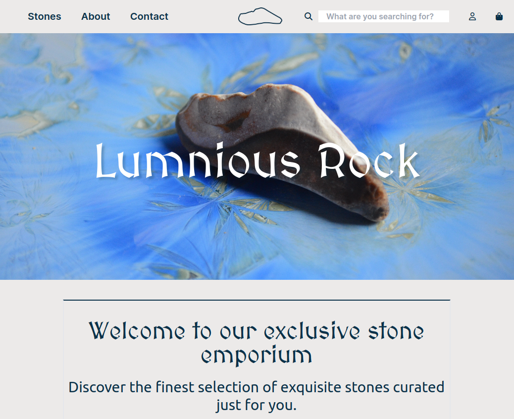

# LuminousRock

## About LuminousRock

LuminousRock is a sleek and engaging fictional online shop dedicated to the sale of stones with unique properties. Our collection includes a variety of stones designed to cater to different needs, whether you're seeking an energy boost or tranquility. This project showcases a blend of HTML, CSS, and Tailwind CSS to create a modern and responsive user interface.

## Technologies

- **HTML**: As the backbone of our webpage structure.
- **CSS**: Utilized for styling and layout design.
- **Tailwind CSS**: Enhances the modern and responsive user experience.

## Features

- **Responsive Design**: Ensures a seamless viewing experience across various devices.
- **Detailed Stone Properties**: Each stone displays specific characteristics, enabling users to make informed choices based on their preferences.
- **Custom Quantity Selection**: Allows users to specify the desired quantity for each stone, offering flexibility in purchasing.

## Live Site

Visit LuminousStones while clicking [here](https://luminousrock.onrender.com) to explore the collection and learn more about the stones.

## Getting Started

To test the website locally, follow these steps:

1. Clone the repository.

2. Navigate to the cloned directory.

3. Open the `index.html` file in your preferred browser to view the website.

## Contact

Should you have any questions, suggestions, or need assistance, feel free to reach out.

## Preview

